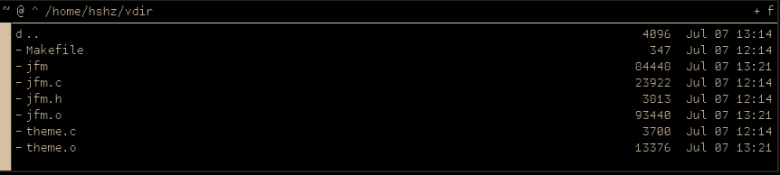

# jfm
jfm is a x11 file manager, it is used to manage files on x11. (jfm stands for just (a) file manager) 



# deps

jfm has dependencies, those dependences are as listed.

## void loonix 

```base-devel libX11-devel libXft-devel libXrender-devel fontconfig-devel freetype-devel pkg-config xdg-utils```

## fbsd

```xorgproto libX11 libXft libXrender fontconfig freetype2 pkgconf gcc xdg-utils```

# license

jfm is licensed under the [MIT license ](LICENSE)

jfm does borrow some code from [the unofficial plan9 visual directory manager](https://github.com/telephil9/vdir)
